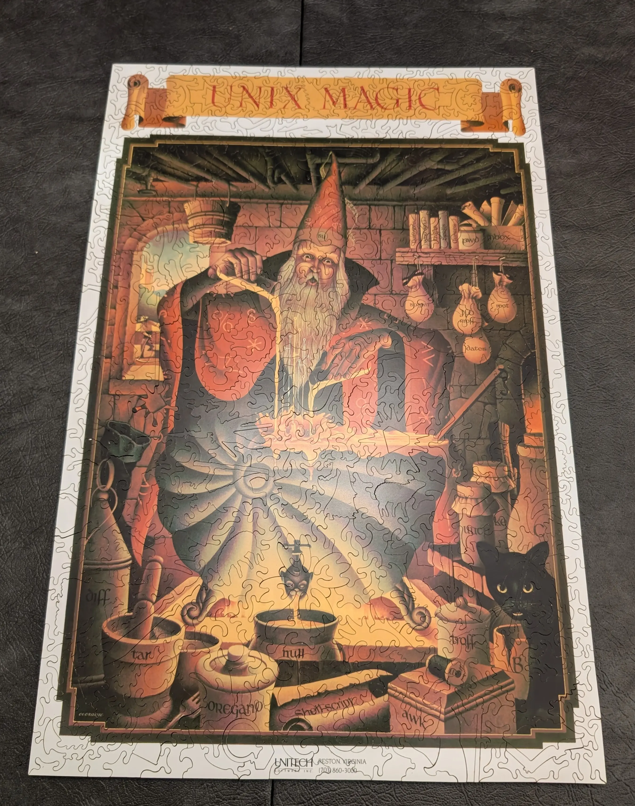

# Unix Magic Poster Reference Tracker

A pipeline that builds [a website](https://unixmagic.net) that maps and documents all the references
found in the classic Usenix Unix Magic poster. The goal is to create a
structured way to explore, annotate, and understand the various elements of the
poster, making it a valuable reference for Unix enthusiasts.

The UNIX Magic poster was created by *Gary Overacre* and published by UniTech
Software, Inc. in the 1980s.

- 🔗 You can find the latest build of this pipeline [here](https://drio.github.io/unixmagic/).
- 📋 Marker [list](https://github.com/drio/unixmagic/issues/4) issue.

Contributions welcome!

### References
- Hacker news [discussion](https://news.ycombinator.com/item?id=43019136).
- Previous HN [discussion](https://news.ycombinator.com/item?id=27029196).
- Jan-Piet Mens [blog post](https://jpmens.net/2021/04/09/the-unix-magic-poster/).

### Contributions welcome!

When contributing, remember that this is an opportunity to dig deep into the
history behind what you’re describing. Feel free to share what this particular
component means to you personally, but also aim to frame the explanation within
the context of Unix’s early days. How did this functionality compare to other
operating systems at the time? What made it special or innovative? This project
is not just about explaining what things are, but understanding why they
mattered—both technically and culturally—in the evolution of Unix.

Here you have the original poster (first image) and a custom puzzle I ordered,
featuring the poster's image.

### The other posters

Did you know Gary created two other posters that never "made it"? Not sure about you, but prefer the "Unix Magic" one.

