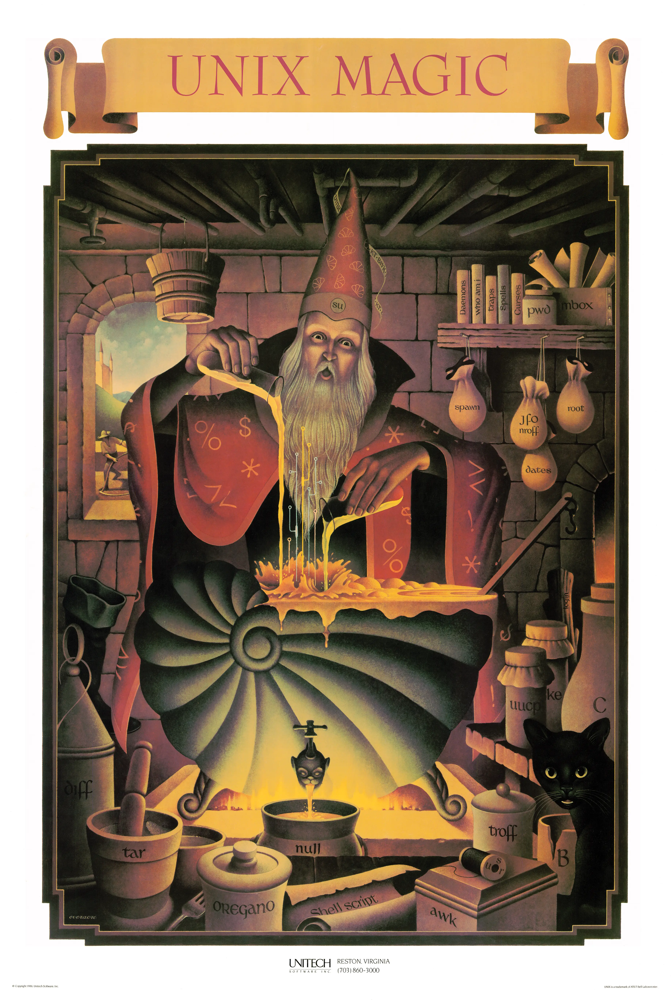
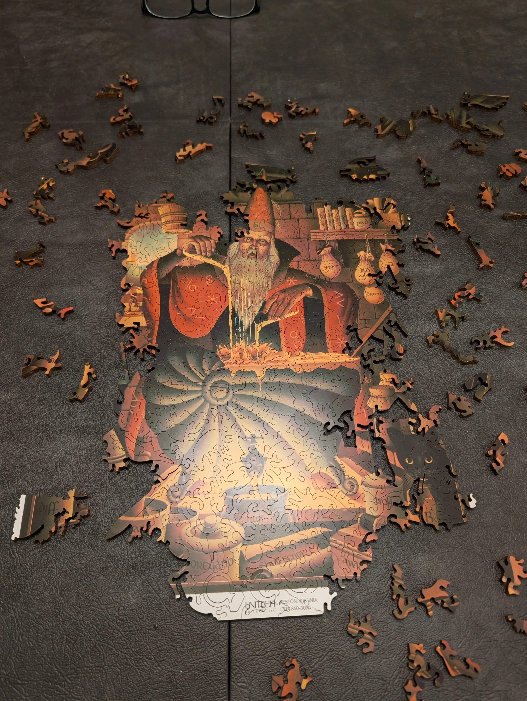
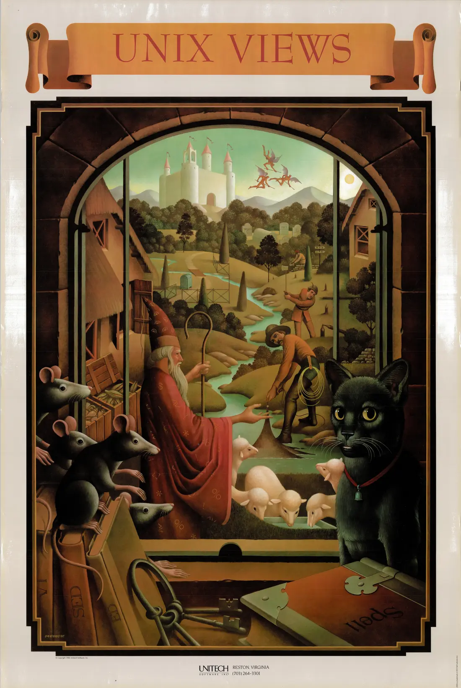
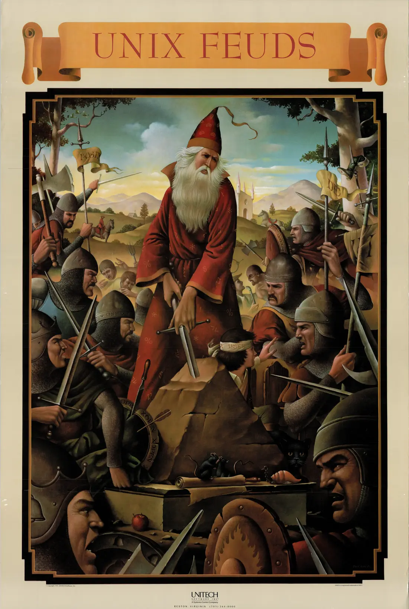

# Unix Magic Poster Reference Tracker

Live site: **[unixmagic.net](https://unixmagic.net)**

A Hugo pipeline that catalogues and annotates every reference on the classic
USENIX UNIX Magic poster. The goal is a structured way to explore and
understand each element of the poster — part reference, part love letter to
early Unix.

The UNIX Magic poster was created by *Gary Overacre* and published by UniTech
Software, Inc. in the 1980s.

- 📋 Marker [list](https://github.com/drio/unixmagic/issues/4) issue.

### References
- Hacker News [discussion (2025)](https://news.ycombinator.com/item?id=43019136).
- Hacker News [discussion (2025, part 2)](https://news.ycombinator.com/item?id=47916769).
- Hacker News [discussion (2021)](https://news.ycombinator.com/item?id=27029196).
- Jan-Piet Mens [blog post](https://jpmens.net/2021/04/09/the-unix-magic-poster/).

### Contributing

Contributions welcome. When adding an annotation, remember this is a chance to
dig into the history behind what you're describing. Share what the component
means to you, but also frame the explanation in the context of Unix's early
days: how did this functionality compare to other systems at the time? What
made it special? This project isn't just about explaining what things are,
but why they mattered — technically and culturally.

Below: the original poster, and a custom puzzle drio had made featuring the
poster's artwork.

### The other posters

Gary also made two other posters that never quite landed the same way. I
prefer "UNIX Magic", but here they are.

